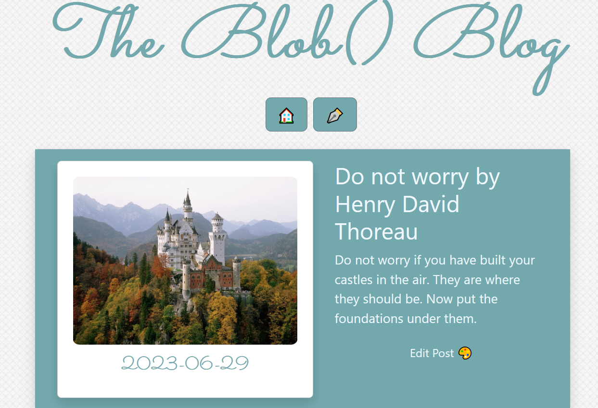

<h1 align="center" id="title">The Blob() blog</h1>




  
<h2>🧐 Features</h2>

Simple blog. Some of the project's features:

- It is possible to see posts data from database as well as image saved on server
- Option to create a new post saving title and body to database and an image file to server
- Option to edit title and body of post
- Option to delete post content both from db and server
- Option to read full post by clicking on post image

To be improved:
- Responsiveness

<h2>🛠️ Installation Steps:</h2>

### Database:

- blob.sql can be found on the root directory of the repository.
- Save SQL file to create a new database.

### Backend

```
cd backend
```

<p>1. Install dependencies:</p>

```
npm i
```

<p>2. Run server:</p>

```
npm start
nodemon
```

By default server will start on port 3001

### Frontend

```
cd blog
```

<p>1. Install dependencies:</p>

```
npm i
```

<p>2. Run React:</p>

```
npm start
```

By default App will start on port 3000

<h2>💻 Built with</h2>

Technologies used in the project:

- JAVASCRIPT
- REACT
- REDUX
- NODE.JS
- MYSQL
- BOOTSTRAP

\*\* Previous HTML version can be found in the html directory
